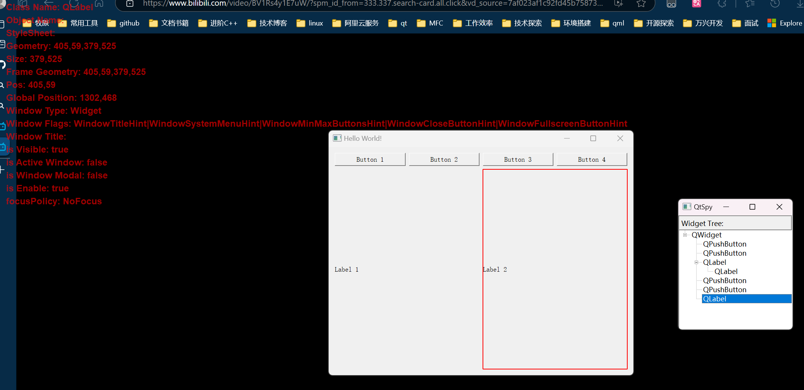

# qwidget调试

## 工具界面



## 兼容windows 和 linux x11
- linux下需要安装x11支持

    `sudo apt-get install libx11-dev libxtst-dev libxext-dev`

# todo
1. [x] 支持插件化
2. [x] 兼容linux X11窗口系统
3. [ ] UI 优化
4. [ ] 支持qgraphicsview
5. [ ] treeview 跳转不正确

# how to use
``` C++
#include "IQSpyInterface.h"
...
...
...
QPluginLoader pluginLoader(fileName); //fileName为插件文件路径
QObject *plugin = pluginLoader.instance();
if (plugin)
{
    //获取插件名称
    QString pluginName = plugin->metaObject()->className();
    if (pluginName == "QSpy")
    {
        //初始化
        auto plugs = qobject_cast<IQSpyInterface *>(plugin);
        plugs->start();
    }
}
```